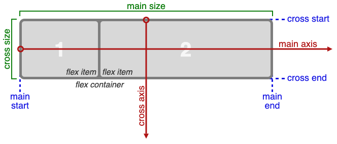

# FREE CODE CAMP SNIPPETS

Collection of code I want to store and document for future reference. Website used and playground to use code and store snippets of fun graphics and anything else that comes along during the challenges at [Free Code Camp](freecodecamp.org).

[SNIPPETS WEBSITE LINK](https://dcbeergoddess.github.io/free-code-camp-snippets/)


## Responsive Design Notes & Code Snippets
### Text-Transform Properties

Value - Result
`lowercase` -	"transform me"
`uppercase` -	"TRANSFORM ME"
`capitalize` -	"Transform Me"
`initial`	- Use the default value
`inherit` -	Use the text-transform value from the parent element
`none` -	Default: Use the original text

### Applied Visual Design
* **Complementary Colors:** Color theory and the impact on design
* [Color Wheel and Color Theory: Canva](https://www.canva.com/colors/color-wheel/)


```
red (#FF0000) and cyan (#00FFFF)
green (#00FF00) and magenta (#FF00FF)
blue (#0000FF) and yellow (#FFFF00)
```

* **Adjust Hue of a Color:** `hsl()` - hue, saturation, lightness
hue = 'color' - on Spectrum of colors - 0-360
saturation = amount of gray - full saturated = no gray = 100%
lightness - amount of white or black - 0% (black) - 100% (white) 
```css
Color: 	HSL
red:	hsl(0, 100%, 50%)
yellow:	hsl(60, 100%, 50%)
green:	hsl(120, 100%, 50%)
cyan:	hsl(180, 100%, 50%)
blue:	hsl(240, 100%, 50%)
magenta:	hsl(300, 100%, 50%)
```
Notes: Cool way to change quite great looking colors schemes quickly

* **Linear Gradients:** `background` property w/ `linear-gradient()` function
```
background: linear-gradient(gradient_direction, color 1, color 2, color 3, ...);

background: linear-gradient(90deg, red, yellow, rgb(204, 204, 255));
```

The `repeating-linear-gradient()` function is very similar to `linear-gradient()` with the major difference that it repeats the specified gradient pattern. `repeating-linear-gradient()` accepts a variety of values, but for simplicity, you'll work with an angle value and color stop values in this challenge.

The angle value is the direction of the gradient. Color stops are like width values that mark where a transition takes place, and are given with a percentage or a number of pixels.

In the example demonstrated in the code editor, the gradient starts with the color `yellow` at 0 pixels which blends into the second color `blue` at 40 pixels away from the start. Since the next color stop is also at 40 pixels, the gradient immediately changes to the third color `green`, which itself blends into the fourth color value `red` as that is 80 pixels away from the beginning of the gradient.

For this example, it helps to think about the color stops as pairs where every two colors blend together.

`0px [yellow -- blend -- blue] 40px [green -- blend -- red] 80px`

If every two color stop values are the same color, the blending isn't noticeable because it's between the same color, followed by a hard transition to the next color, so you end up with stripes.
```css
  div{
    border-radius: 20px;
    width: 70%;
    height: 400px;
    margin:  50 auto;
    background: repeating-linear-gradient(
      90deg,
      yellow 0px,
      blue 40px,
      green 40px,
      red 80px
    );
  }

    div{
    border-radius: 20px;
    width: 70%;
    height: 400px;
    margin:  50 auto;
    background: repeating-linear-gradient(
      45deg,
      yellow 0px,
      yellow 40px,
      black 40px,
      black 80px
    );
  }
  ```

  * **Transform Property:**
  ```css
    transform: scale()

    p:hover {
      transform: scale(2);
    }
  ```
  * skewX = (horizontal) X axis by a given degree
  * skewY() =along the Y (vertical) axis.
  ```css
    transform: scewX()

    p {
      transform: skewX(-32deg);
    }  
  ```
* **CREATE GRAPHICS:** manipulate different selectors and properties. i.e. w/ `box-shadow` using `blur-radius` and `spread-radius`
* using `before::` and `after::` - use to create heart - for function properly they must have a defined `content` property - add photo or text to selected element || set to empty string for shapes 
* **animations:** `@keyframes` = what happens during animation || `animation-name` = name used by `@keyframes` || `animation-duration` = length of time for the animation || `hover::` = change width of image on hover || change color but need to use `animation-fill-mode`
```html
  <style>
  img:hover {
    animation-name: width;
    animation-duration: 500ms;
  }

  @keyframes width {
    100% {
      width: 40px;
    }
  }
</style>


<!-- COLOR CHANGE -->
<style>
  button {
    border-radius: 5px;
    color: white;
    background-color: #0F5897;
    padding: 5px 10px 8px 10px;
  }

  button:hover {
    animation-name: background-color;
    animation-duration: 500ms;
  }
  @keyframes background-color {
    100% {
      background-color: #4791d0;
    }
  }

</style>

<button>Register</button>

<!-- ANIMATION FILL MODE to FORWARDS to KEEP IMAGE AT THAT COLOR WILL HOVER -->
<style>
  button {
    border-radius: 5px;
    color: white;
    background-color: #0F5897;
    padding: 5px 10px 8px 10px;
  }
  button:hover {
    animation-name: background-color;
    animation-duration: 500ms;
    /* Only change code below this line */
    animation-fill-mode: forwards;
    /* Only change code above this line */
  }
  @keyframes background-color {
    100% {
      background-color: #4791d0;
    }
  }
</style>
<button>Register</button>
```

* **CREATE MOVEMENT:** 
```css
/* As shown in the example below, you can push the item downwards then upwards by setting the top property of the 50% keyframe to 50px, but having it at to 0px for the first (0%) and the last (100%) keyframe. */

@keyframes rainbow {
  0% {
    background-color: blue;
    top: 0px;
  }
  50% {
    background-color: green;
    top: 50px;
  }
  100% {
    background-color: yellow;
    top: 0px;
  }
}
```
```html
<!-- Add a horizontal motion to the div animation. Using the left offset property, add to the @keyframes rule so rainbow starts at 0 pixels at 0%, moves to 25 pixels at 50%, and ends at -25 pixels at 100%. Don't replace the top property in the editor - the animation should have both vertical and horizontal motion. -->
<style>
  div {
    height: 40px;
    width: 70%;
    background: black;
    margin: 50px auto;
    border-radius: 5px;
    position: relative;
  }

  #rect {
    animation-name: rainbow;
    animation-duration: 4s;
  }

  @keyframes rainbow {
    0% {
      background-color: blue;
      top: 0px;
      left: 0px;
    }
    50% {
      background-color: green;
      top: 50px;
      left: 25px;
    }
    100% {
      background-color: yellow;
      top: 0px;
      left: -25px;
    }
  }
</style>

<div id="rect"></div>
```
* **Fading an Element:** From left to right | change `opacity` of an animated element so it gradually fades as it reaches the right of the screen
```html
<!-- In the displayed animation, the round element with the gradient background moves to the right by the 50% mark of the animation per the @keyframes rule. -->
<!-- Target the element with the id of ball and add the opacity property set to 0.1 at 50%, so the element fades as it moves to the right. -->
<style>

  #ball {
    width: 70px;
    height: 70px;
    margin: 50px auto;
    position: fixed;
    left: 20%;
    border-radius: 50%;
    background: linear-gradient(
      35deg,
      #ccffff,
      #ffcccc
    );
    animation-name: fade;
    animation-duration: 3s;
  }

  @keyframes fade {
    50% {
      left: 60%;
      opacity: 0.1;
    }
  }

</style>

<div id="ball"></div>

```

* `animation-iteration-count`: when set to `infinite` for continuous loop
```html
<!-- ball bouncing up and down continuous -->
<style>

  #ball {
    width: 100px;
    height: 100px;
    margin: 50px auto;
    position: relative;
    border-radius: 50%;
    background: linear-gradient(
      35deg,
      #ccffff,
      #ffcccc
    );
    animation-name: bounce;
    animation-duration: 1s;
    animation-iteration-count: infinite;
  }

  @keyframes bounce{
    0% {
      top: 0px;
    }
    50% {
      top: 249px;
      width: 130px;
      height: 70px;
    }
    100% {
      top: 0px;
    }
  }
</style>
<div id="ball"></div>

<!-- HEART BEAT BEATING -->
<!-- Here's one more continuous animation example with the animation-iteration-count property that uses the heart you designed in a previous challenge.

The one-second long heartbeat animation consists of two animated pieces. The heart elements (including the :before and :after pieces) are animated to change size using the transform property, and the background div is animated to change its color using the background property. -->
<!-- Keep the heart beating by adding the animation-iteration-count property for both the back class and the heart class and setting the value to infinite. The heart:before and heart:after selectors do not need any animation properties. -->

<style>
  .back {
    position: fixed;
    padding: 0;
    margin: 0;
    top: 0;
    left: 0;
    width: 100%;
    height: 100%;
    background: white;
    animation-name: backdiv;
    animation-duration: 1s;
    animation-iteration-count: infinite;
  }

  .heart {
    position: absolute;
    margin: auto;
    top: 0;
    right: 0;
    bottom: 0;
    left: 0;
    background-color: pink;
    height: 50px;
    width: 50px;
    transform: rotate(-45deg);
    animation-name: beat;
    animation-duration: 1s;
    animation-iteration-count: infinite;
  }
  .heart:after {
    background-color: pink;
    content: "";
    border-radius: 50%;
    position: absolute;
    width: 50px;
    height: 50px;
    top: 0px;
    left: 25px;
  }
  .heart:before {
    background-color: pink;
    content: "";
    border-radius: 50%;
    position: absolute;
    width: 50px;
    height: 50px;
    top: -25px;
    left: 0px;
  }

  @keyframes backdiv {
    50% {
      background: #ffe6f2;
    }
  }

  @keyframes beat {
    0% {
      transform: scale(1) rotate(-45deg);
    }
    50% {
      transform: scale(0.6) rotate(-45deg);
    }
  }

</style>
<div class="back"></div>
<div class="heart"></div>
```
* **Variable Rates:** here are a variety of ways to alter the animation rates of similarly animated elements. So far, this has been achieved by applying an animation-iteration-count property and setting @keyframes rules.

To illustrate, the animation on the below consists of two stars that each decrease in size and opacity at the 20% mark in the @keyframes rule, which creates the twinkle animation. You can change the @keyframes rule for one of the elements so the stars twinkle at different rates.
```html
<!-- Alter the animation rate for the element with the class name of star-1 by changing its @keyframes rule to 50%. -->

<style>
  .stars {
    background-color: white;
    height: 30px;
    width: 30px;
    border-radius: 50%;
    animation-iteration-count: infinite;
  }

  .star-1 {
    margin-top: 15%;
    margin-left: 60%;
    animation-name: twinkle-1;
    animation-duration: 1s;
  }

  .star-2 {
    margin-top: 25%;
    margin-left: 25%;
    animation-name: twinkle-2;
    animation-duration: 1s;
  }

  @keyframes twinkle-1 {
    50% {
      transform: scale(0.5);
      opacity: 0.5;
    }
  }

  @keyframes twinkle-2 {
    20% {
      transform: scale(0.5);
      opacity: 0.5;
    }
  }

  #back {
    position: fixed;
    padding: 0;
    margin: 0;
    top: 0;
    left: 0;
    width: 100%;
    height: 100%;
    background: linear-gradient(black, #000099, #66c2ff, #ffcccc, #ffeee6);
  }
</style>

<div id="back"></div>
<div class="star-1 stars"></div>
<div class="star-2 stars"></div>
```

* **Animate Multiple Elements at Variable Rates**
- In the previous challenge, you changed the animation rates for two similarly animated elements by altering their @keyframes rules. You can achieve the same goal by manipulating the animation-duration of multiple elements.

```html
<!-- In the animation running in the code editor, there are three stars in the sky that twinkle at the same rate on a continuous loop. To make them twinkle at different rates, you can set the animation-duration property to different values for each element. -->

<style>
  .stars {
    background-color: white;
    height: 30px;
    width: 30px;
    border-radius: 50%;
    animation-iteration-count: infinite;
  }

  .star-1 {
    margin-top: 15%;
    margin-left: 60%;
    animation-duration: 1s;
    animation-name: twinkle;
  }

  .star-2 {
    margin-top: 25%;
    margin-left: 25%;
    animation-duration: 0.9s;
    animation-name: twinkle;
  }

  .star-3 {
    margin-top: 10%;
    margin-left: 50%;
    animation-duration: 1.1s;
    animation-name: twinkle;
  }

  @keyframes twinkle {
    20% {
      transform: scale(0.5);
      opacity: 0.5;
    }
  }

  #back {
    position: fixed;
    padding: 0;
    margin: 0;
    top: 0;
    left: 0;
    width: 100%;
    height: 100%;
    background: linear-gradient(black, #000099, #66c2ff, #ffcccc, #ffeee6);
  }
</style>

<div id="back"></div>
<div class="star-1 stars"></div>
<div class="star-2 stars"></div>
<div class="star-3 stars"></div>
```

* **Change Animation TIming with Keywords**
- In CSS animations, the `animation-timing-function` property controls how quickly an animated element changes over the duration of the animation. If the animation is a car moving from point A to point B in a given time (your animation-duration), the animation-timing-function says how the car accelerates and decelerates over the course of the drive.
- There are a number of predefined keywords available for popular options. For example, the default value is ease, which starts slow, speeds up in the middle, and then slows down again in the end. Other options include ease-out, which is quick in the beginning then slows down, ease-in, which is slow in the beginning, then speeds up at the end, or linear, which applies a constant animation speed throughout.
```html
<!-- For the elements with id of ball1 and ball2, add an animation-timing-function property to each, and set #ball1 to linear, and #ball2 to ease-out. Notice the difference between how the elements move during the animation but end together, since they share the same animation-duration of 2 seconds. -->

<style>

  .balls {
    border-radius: 50%;
    background: linear-gradient(
      35deg,
      #ccffff,
      #ffcccc
    );
    position: fixed;
    width: 50px;
    height: 50px;
    margin-top: 50px;
    animation-name: bounce;
    animation-duration: 2s;
    animation-iteration-count: infinite;
  }
  #ball1 {
    left:27%;
    animation-timing-function: linear;
  }
  #ball2 {
    left:56%;
    animation-timing-function: ease-out;
  }

  @keyframes bounce {
    0% {
      top: 0px;
    }
    100% {
      top: 249px;
    }
  }

</style>

<div class="balls" id="ball1"></div>
<div class="balls" id="ball2"></div>
```

* **BEZIER CURVE:** SMOOTHER TRANSITION
- In CSS animations, Bezier curves are used with the `cubic-bezier` function. The shape of the curve represents how the animation plays out. The curve lives on a 1 by 1 coordinate system. The X-axis of this coordinate system is the duration of the animation (think of it as a time scale), and the Y-axis is the change in the animation.
- The `cubic-bezier` function consists of four main points that sit on this 1 by 1 grid: `p0`, `p1`, `p2`, and `p3`. `p0` and `p3` are set for you - they are the beginning and end points which are always located respectively at the origin (0, 0) and (1, 1). You set the x and y values for the other two points, and where you place them in the grid dictates the shape of the curve for the animation to follow. This is done in CSS by declaring the x and y values of the `p1` and `p2` "anchor" points in the form: `(x1, y1, x2, y2)`. Pulling it all together, here's an example of a Bezier curve in CSS code:
`animation-timing-function: cubic-bezier(0.25, 0.25, 0.75, 0.75);`
- In the example above, the x and y values are equivalent for each point (x1 = 0.25 = y1 and x2 = 0.75 = y2), which if you remember from geometry class, results in a line that extends from the origin to point (1, 1). This animation is a linear change of an element during the length of an animation, and is the same as using the `linear` keyword. In other words, it changes at a constant speed.
```html
<!-- For the element with the id of ball1, change the value of the animation-timing-function property from linear to its equivalent cubic-bezier function value. Use the point values given in the example above. -->
<style>

  .balls{
    border-radius: 50%;
    background: linear-gradient(
      35deg,
      #ccffff,
      #ffcccc
    );
    position: fixed;
    width: 50px;
    height: 50px;
    margin-top: 50px;
    animation-name: bounce;
    animation-duration: 2s;
    animation-iteration-count: infinite;
  }
  #ball1 {
    left: 27%;
    animation-timing-function: cubic-bezier(0.25, 0.25, 0.75, 0.75);
  }
  #ball2 {
    left: 56%;
    animation-timing-function: ease-out;
  }

  @keyframes bounce {
    0% {
      top: 0px;
    }
    100% {
      top: 249px;
    }
  }

</style>

<div class="balls" id="ball1"></div>
<div class="balls" id="ball2"></div>

```
- Remember that all `cubic-bezier` functions start with `p0` at (0, 0) and end with `p3` at (1, 1). In this example, the curve moves faster through the Y-axis (starts at 0, goes to `p1` y value of 0, then goes to `p2` y value of 1) than it moves through the X-axis (0 to start, then 0 for `p1`, up to 0.58 for `p2`). As a result, the change in the animated element progresses faster than the time of the animation for that segment. Towards the end of the curve, the relationship between the change in x and y values reverses - the y value moves from 1 to 1 (no change), and the x values move from 0.58 to 1, making the animation changes progress slower compared to the animation duration.
```html
<!-- To see the effect of this Bezier curve in action, change the animation-timing-function of the element with id of red to a cubic-bezier function with x1, y1, x2, y2 values set respectively to 0, 0, 0.58, 1. This will make both elements progress through the animation similarly. -->

<style>
  .balls{
    border-radius: 50%;
    position: fixed;
    width: 50px;
    height: 50px;
    margin-top: 50px;
    animation-name: bounce;
    animation-duration: 2s;
    animation-iteration-count: infinite;
  }
  #red {
    background: red;
    left: 27%;
    animation-timing-function: cubic-bezier(0,0,0.58,1);
  }
  #blue {
    background: blue;
    left: 56%;
    animation-timing-function: ease-out;
  }
  @keyframes bounce {
    0% {
      top: 0px;
    }
    100% {
      top: 249px;
    }
  }
</style>
<div class="balls" id= "red"></div>
<div class="balls" id= "blue"></div>
```

* **MAKE MOTION MORE NATURAL**
- This challenge animates an element to replicate the movement of a ball being juggled. Prior challenges covered the `linear` and `ease-out` cubic Bezier curves, however neither depicts the juggling movement accurately. You need to customize a Bezier curve for this.
- The `animation-timing-function` automatically loops at every keyframe when the `animation-iteration-count` is set to `infinite`. Since there is a keyframe rule set in the middle of the animation duration (at `50%`), it results in two identical animation progressions at the upward and downward movement of the ball.
- The following cubic Bezier curve simulates a juggling movement:
  `cubic-bezier(0.3, 0.4, 0.5, 1.6);`
  - Notice that the value of y2 is larger than 1. Although the cubic Bezier curve is mapped on a 1 by 1 coordinate system, and it can only accept x values from 0 to 1, the y value can be set to numbers larger than one. This results in a bouncing movement that is ideal for simulating the juggling ball.
  ```html
  <!-- Change value of the animation-timing-function of the element with the id of green to a cubic-bezier function with x1, y1, x2, y2 values set respectively to 0.311, 0.441, 0.444, 1.649. -->
  <style>
  .balls {
    border-radius: 50%;
    position: fixed;
    width: 50px;
    height: 50px;
    top: 60%;
    animation-name: jump;
    animation-duration: 2s;
    animation-iteration-count: infinite;
  }
  #red {
    background: red;
    left: 25%;
    animation-timing-function: linear;
  }
  #blue {
    background: blue;
    left: 50%;
    animation-timing-function: ease-out;
  }
  #green {
    background: green;
    left: 75%;
    animation-timing-function: cubic-bezier(0.311, 0.441, 0.444, 1.649);
  }

  @keyframes jump {
    50% {
      top: 10%;
    }
  }
</style>
<div class="balls" id="red"></div>
<div class="balls" id="blue"></div>
<div class="balls" id="green"></div>
  ```

  ## Applied Accessibility

  - `alt` attribute: add a text alternative to images for visually impaired accessibility || helps when image fails to load, etc. || also used by search engines to to understand what an image contains ot include it in search results.
  - **Screen Readers:** Convert web content to an audio interface - won't get info if it's only presented visually
  - per HTML5 it is now considered mandatory
  - NO `alt` attribute: images grouped with caption already describing them or decoration only, set to empty string `alt=""` || for images with a caption you may still want to include `alt` for the search engines 
  ```html
  <!-- Camper Cat has coded a skeleton page for the blog part of his website. He's planning to add a visual break between his two articles with a decorative image of a samurai sword. Add an alt attribute to the img tag and set it to an empty string. (Note that the image src doesn't link to an actual file - don't worry that there are no swords showing in the display.) -->
    <h1>Deep Thoughts with Master Camper Cat</h1>
    <article>
      <h2>Defeating your Foe: the Red Dot is Ours!</h2>
      <p>To Come...</p>
    </article>

    

    <article>
      <h2>Is Chuck Norris a Cat Person?</h2>
      <p>To Come...</p>
    </article>
  ```
* Use Headings to Show Hierarchical Relationships of Content
- Important for header tags to have semantic meaning and not just used for size - Screen Readers can be set to only read headings so user gets summary
- __Semantic meaning__ means that the tag you use around content indicates the type of information it contains || Sort of like writing a paper where you have a hierarchical relationship of content (intro, body, conclusion)
- Heading with equal or higher rank start new implied sections, heading with lower rank start subsections of the previous one
- As an example, a page with an `h2` element followed by several subsections labeled with `h4` tags would confuse a screen reader user. With six choices, it's tempting to use a tag because it looks better in a browser, but you can use CSS to edit the relative sizing.
- EACH PAGE SHOULD HAVE ONE AND ONLY ONE `h1`
* **Jump Straight to the Content Using the main Element**
- HTML5 introduces new elements for developers while also incorporating accessibility features
- `main || header || footer || nav || article || section` : among others all equal to a `div` but adds semantic meaning 
* `main` : wrap the main content, only one per page, surround info related to the main content of the page || Do not include items that repeat across pages (navs, banners, etc.)
- tag also has embedded landmark feature that assistive technology can use to quickly navigate to the main content "Jump to Main Content" link at the top fo the page give assistive devices tha functionality 
* `article` : a sectioning element || used to wrap independent, self-contained content || works well with blog entries, forum posts, or new articles
- Will content hold up in RSS feed? If all surrounding content was removed would it make sense
- NOTE: `section` vs. `article` || grouping thematically related content vs. standalone content, if no relationship use a div
- `<div>` - groups content
- `<section>` - groups related content 
- `<article>` - groups independent, self-contained content
* `header`: intro information or nav links for it's parent tag works well for content that's repeated across pages 
* `nav`: embedded landmark feature for easy screen reader like others | mean to wrap around main navigation links of your page
* `footer`: primary used for copyright information or links to related documents | can use for repeated links at bottom of page
#### Accessibility and Audio
* Improve Accessibility fo Audio Content with the audio Element
- `audio`: gives semantic meaning when it wraps sound or audio stream content in your markup | needs alternative text to be accessible to people who are deaf or hard of hearing - can be done with nearby text on the page or a link to a transcript
- supports the `controls` attribute: shows the browser default play, pause, and other controls, and supports keyboard functionality. this is `boolean` attribute, does not need a value, it's presence on the tag turns the setting on
```html
  <audio id="meowClip" controls>
      <source src="audio/meow.mp3" type="audio/mpeg"/>
      <source src="audio/meow.ogg" type="audio.ogg"/>
  </audio>
  <!-- Note: Multimedia content usually has both visual and auditory components. It needs synchronized captions and a transcript so users with visual and/or auditory impairments can access it. Generally, a web developer is not responsible for creating the captions or transcript, but needs to know to include them. -->

    <body>
    <header>
      <h1>Real Coding Ninjas</h1>
    </header>
    <main>
      <p>A sound clip of Zersiax's screen reader in action.
        <audio controls>
          <source src="https://s3.amazonaws.com/freecodecamp/screen-reader.mp3" type="audio/mpeg"/>
        </audio>
      </p>


        </main>
      </body>
```
### Accessibility and Charts, Forms
* `figure` : introduced by HTML5, along with `figcaption` || Used together to wrap a visual representation (img, diagram, chart) along with it's caption
- semantically grouping related content and provides text alternative that explains the `figure`
- For data visualizations like charts, the caption can be used to briefly note the trends or conclusions for users with visual impairments
```html
  <figure>
  
  <br>
  <figcaption>
    Master Camper Cat demonstrates proper form of a roundhouse kick.
  </figcaption>
</figure>

<!-- CHALLENGE -->
      <!-- Only change code below this line -->
      <figure>
        <!-- Stacked bar chart will go here -->
        <br>
        <figcaption>Breakdown per week of time to spend training in stealth, combat, and weapons.</figcaption>
      </figure>
      <!-- Only change code above this line -->
```

* Improving accessibility with semantic HTML markup applies to using BOTH 1. appropriate tag names as well as 2. attributes

* **Forms and Attributes**

* `label` : wraps the text for a specific *form control item* | Usually a `name` or label for a choice. 
* `for` : attribute on a `label` | associates the `label` with the *form control* and is used by *screen readers*
* The value of `for` must = the value of `id` on the *form control*
```html
  <form>
  <label for="name">Name:</label>
  <input type="text" id="name" name="name">
  </form>

```
* `fieldset` : radio buttons | surrounds teh entire group of radio buttons - semantically show they are part of a set | use `legend` tag to provide description for the grouping, which is read by *screen readers* for each choice in the fieldset element 
- `fieldset` and `legend` are not necessary when choices are self-explanatory, like a gender selection - using `label` and `for` for each radio button is sufficient
```html
  <form>
  <fieldset>
    <legend>Choose one of these three items:</legend>
    <input id="one" type="radio" name="items" value="one">
    <label for="one">Choice One</label><br>
    <input id="two" type="radio" name="items" value="two">
    <label for="two">Choice Two</label><br>
    <input id="three" type="radio" name="items" value="three">
    <label for="three">Choice Three</label>
  </fieldset>
</form>

<!-- ANOTHER EXAMPLE -->
    <fieldset>
    <legend>What level ninja are you?</legend>
    <input id="newbie" type="radio" name="levels" value="newbie">
    <label for="newbie">Newbie Kitten</label><br>
    <input id="intermediate" type="radio" name="levels" value="intermediate">
    <label for="intermediate">Developing Student</label><br>
    <input id="master" type="radio" name="levels" value="master">
    <label for="master">Master</label>
    </fieldset>
```
* **ACCESSIBLE DATE PICKER** : HTML5 --> option to specify `date` in the `type` attribute 
- For older browsers, the type will default to `text`, so it helps to show users the expected date format in the `label` or `placeholder` text just in case.
```html
  <label for="input1">Enter a date:</label>
  <input type="date" id="input1" name="input1">

  <!-- ANOTHER EXAMPLE -->
        <form>
        <p>Tell us the best date for the competition</p>
        <label for="pickdate">Preferred Date:</label>
        <input type="date" id="pickdate" name="date">
        <input type="submit" name="submit" value="Submit">
      </form>
```

* `time` and `datetime`: attributes to standardize times | *inline element* that can wrap a date or time on a page. A valid format of that date is hed b the `datetime` 
```html
<p>Master Camper Cat officiated the cage match between Goro and Scorpion <time datetime="2013-02-13">last Wednesday</time>, which ended in a draw.</p>
<!-- Another Example -->
<p>Posted by: Sub-Zero on <time datetime="2016-08-13T20:01Z">August 13<sup>th</sup></time></p>
```
### Using Custom CSS - Visible only to Screen Reader

- visually hide content meant only for screen readers
- happens when information is in a visual format (like a chart), but *screen readers* users need an alternative presentation (like a table) to access the data
- CSS used to position the *screen reader-only* elements off the visual area of the browser window.
```css
.sr-only {
  position: absolute;
  left: -10000px;
  width: 1px;
  height: 1px;
  top: auto;
  overflow: hidden;
}
/* The Following CSS approaches WILL NOTdo the same thing: */
table {
  display: none;
  /* or */
  visibility: hidden;
}

/* Zero Values for pixel sizes removes element from flow of document and screen readers will ignore it */

table {
  width: 0px;
  height: 0px;
}
```
### Improve Readability with High Contrast Text
- **Web Content Accessibility Guidelines (WCAG)** recommend at least a 4.5 to 1 contrast ratio for normal text
- **Sufficient Contrast** improves readability of your content 
- ratio calculated by comparing the relative luminance values of two colors
- 1:1 = same color/no contrast || 21:1 = white against black
- Many contrast checking tools available online
- **Colorblindness and Sufficient Contrast:** Foreground and background colors need sufficient contrast so colorblind users can distinguish them
- In practice, the 4.5:1 contrast ratio can by reached by *shading* (adding black to) the darker color and *tinting* (adding white to) the lighter color.
- *dark* = blues, violets, magentas, and reds
- *lighter* = oranges, yellow, greens, and blue-greens
```css
/* Camper Cat is experimenting with using color for his blog text and background, but his current combination of a greenish background-color with maroon text color has a 2.5:1 contrast ratio. You can easily adjust the lightness of the colors since he declared them using the CSS hsl() property (which stands for hue, saturation, lightness) by changing the third argument. Increase the background-color lightness value from 35% to 55%, and decrease the color lightness value from 20% to 15%. This improves the contrast to 5.9:1.
 */
   body {
    color: hsl(0, 55%, 20%);
    background-color: hsl(120, 25%, 35%);
  }

/* CHANGE TO */

  body {
    color: hsl(0, 55%, 15%);
    background-color: hsl(120, 25%, 55%);
  }
```
* *Colorblindness Issues*: carefully choosing colors that convey information
* _There are various forms of colorblindness. These can range from a reduced sensitivity to a certain wavelength of light to the inability to see color at all. The most common form is a reduced sensitivity to detect greens._
- Avoid close colors (i.e. neighbors on the color wheel) when conveying important information
- _Note: Some online color picking tools include visual simulations of how colors appear for different types of colorblindness. These are great resources in addition to online contrast checking calculators._
```html
<!-- EXAMPLE -->
<!-- Camper Cat is testing different styles for an important button, but the yellow (#FFFF33) background-color and the green (#33FF33) text color are neighboring hues on the color wheel and virtually indistinguishable for some colorblind users. (Their similar lightness also fails the contrast ratio check). Change the text color to a dark blue (#003366) to solve both problems. -->
<!-- +++++++++++BEFORE+++++++++++++++++++++ -->

<head>
  <style>
  button {
    color: #33FF33;
    background-color: #FFFF33;
    font-size: 14px;
    padding: 10px;
  }
  </style>
</head>
<body>
  <header>
    <h1>Danger!</h1>
  </header>
  <button>Delete Internet</button>
</body>

<!-- +++++++++++AFTER+++++++++++++++++++++ -->
  <style>
  button {
    color: #33FF33;
    background-color: #FFFF33;
    font-size: 14px;
    padding: 10px;
  }
  </style>
```

### LINKS/ANCHOR TAGS and ACCESSIBILITY
- give links meaning by using descriptive link text
- *screen readers* have different options for what type of content their device reads || includes skipping to (or over) landmark elements ==> jump to main content, only hear links available on page
- *screen readers* read text between the `a` tags - You should use brief but descriptive text || NOT JUST "click me" or "read more"
```html
  <!-- BADBADBADBADBADBADBADBAD -->
      <p>Felines the world over have been waging war on the most persistent of foes. This red nemesis combines both cunning stealth and lightning speed. But chin up, fellow fighters, our time for victory may soon be near. <a href="">Click here</a> for information about batteries</p>
  <!-- GOODGOODGOODGOODGOODGOODGOOD-->
      <p>Felines the world over have been waging war on the most persistent of foes. This red nemesis combines both cunning stealth and lightning speed. But chin up, fellow fighters, our time for victory may soon be near. Click here for <a href="">information about batteries</a></p>
```
- `accesskey`: Make links navigable with **HTML Access Keys** || specify shortcut key to activate or bring focus to an element - navigation more efficient fo keyboard-users 
- allowed on any element - particularly useful for interactive ones (links, buttons, form controls)
```html
<button accesskey="b">Important Button</button>
<!-- or -->
    <h2><a id="first" href="#" accesskey= "g">The Garfield Files: Lasagna as Training Fuel?</a></h2>
    <h2><a id="second" href="#" accesskey="c">Is Chuck Norris a Cat Person?</a></h2>

```
* `tabindex`: add keyboard focus to an element || 3 DISTINCT FUNCTIONS relating to an element's keyboard focus - when on tag, indicated element can be focused on - The VALUE (an integer that's positive, negative, or zero) determines the behavior.
- links and form controls - automatically receive keyboard focus when a user tabs through a page | order they appear in the HTML source makeup
- give `div`, `span`, and `p` elements same functionality by placing `tabindex="0"` attribute on them
```html
<div tabindex="0">I need keyboard focus!</div>
<!-- or -->
<!-- Camper Cat created a new survey to collect information about his users. He knows input fields automatically get keyboard focus, but he wants to make sure his keyboard users pause at the instructions while tabbing through the items. Add a tabindex attribute to the p tag and set its value to 0. Bonus - using tabindex also enables the CSS pseudo-class :focus to work on the p tag. -->

  <style>
  p:focus {
    background-color: yellow;
  }
  </style>
</head>
<body>
  <header>
    <h1>Ninja Survey</h1>
  </header>
  <section>
    <form>


      <p tabindex="0">Instructions: Fill in ALL your information then click <b>Submit</b></p>


```
- _Note: A negative tabindex value (typically -1) indicates that an element is focusable, but is not reachable by the keyboard. This method is generally used to bring focus to content programmatically (like when a div used for a pop-up window is activated), and is beyond the scope of these challenges._

* `tabindex`: specify order of keyboard focus for several items
- set `tabindex="1"`: Bring focus to that element first then cycles through sequence of specified `tabindex` values before moving to the default `tabindex="0"` items
- Take care before applying it - may confuse users who expect to start navigation from the top of the page
```html
  <div tabindex="1">I get keyboard focus, and I get it first!</div>

  <div tabindex="2">I get keyboard focus, and I get it second!</div>  

  <!-- or -->
  <!-- Camper Cat has a search field on his Inspirational Quotes page that he plans to position in the upper right corner with CSS. He wants the search input and submit input form controls to be the first two items in the tab order. Add a tabindex attribute set to 1 to the search input, and a tabindex attribute set to 2 to the submit input. -->
    <form>
    <label for="search">Search:</label>


    <input tabindex="1" type="search" name="search" id="search">
    <input tabindex="2" type="submit" name="submit" value="Submit" id="submit">


  </form>
```

### Responsive Web Design Principles
#### Media Query
- Change the presentation of content based on different viewpoint sizes
- Media query that returns the content when the device's width is less than or equal to 100px: `@media (max-width: 100px) {/* CSS Rules */}`
- Media query returns the content when the device's height is more than or equal to 350px: `@media (min-height: 350px) {/* CSS Rules */}`
- Add a media query, so that the p tag has a font-size of 10px when the device's height is less than or equal to 800px.
```css
    p {
    font-size: 20px;
  }

  @media (max-height: 800px) {
    p {
      font-size: 10px
    }
  }
```
#### Make Image Responsive
- The `max-width` of `100%` will make sure the image is never wider thn the container it is in, and the `height` of `auto` will make the image keep it's original aspect ratio.
```css
  img {
    max-width: 100%;
    height: auto;
  }
```
#### Retina Image for Higher Resolution Displays
- Pixel density is an aspect that could be different on one device from others
- density - **Pixel Per Inch (PPI)** or **Dots Per Inch(DPI)** 
- **Retina Display** most famous such display - latest MacBook Pro, etc | Some images that have not been made with a High-Res Display in mind could look "pixelated"  when rendered on High-Resolution display.
- MAKE IMAGES PROPERLY appear on High-Res = define their `width` and `height` values as only half of what the original file is:
```html
  <style>
  img { height: 250px; width: 250px; }
  </style>
  
```

#### Make Typography Responsive
- INSTEAD OF Using `em` or `px` to size text ----> USE **viewport units** for responsive typography || are relative units and are relative to the viewport dimensions (width or height) of device vs **percentages** which are relative to the size of the parent container
- FOUR DIFFERENT VIEWPORT UNITES
1. `vw` (viewport width): `10vw` would be 10% of the viewport's width
2. `vh` (viewport height): `3vh` would be 3& of viewport's height
3. `vmin` (viewport minimum): `70vmin` would be 70% of the viewport's smaller dimension (height or width)
4. `vmax` (viewport maximum): `100vmax` would be 100% of the viewport's bigger dimension (height or width)
```css
/* Set Body Tag to 30% of viewport's width */
    body {
      width: 30vw;
    }
/* Set the width of the h2 tag to 80% of the viewport's width and the width of the paragraph as 75% of the viewport's smaller dimension. */
    h2 {
      width: 80vw;
    }
    p {
      width: 75vmin;
    }
```
### CSS Flexbox
- `display: flex`: CSS Property - allows you to use other flex properties to build a responsive page | turns element into a **flex container** = align any children of that element into rows or columns using `flex-direction`
- Check out twitter/tweet example [TWEET CODE](pages/twitter.html)
- `flex-direction`: set it to `row` (align children horizontally) or `column` (align children vertically)
- More Options: `row-reverse` and `column-reverse`
- DEFAULT PROPERTY = `row`
#### Align Elements Using the `justify-content` Property

- `row` - stacked left-to-right | horizontal | **main-axis** = horizontal line that cuts through each item
- `column` - stacked top-to-bottom | vertical | **main-axis** = vertical line that cuts through the items
##### Values for `justify-content`
* `center`: aligns all flex items to the center inside the flex container
* `flex-start`: align items to the start of the flex container | `row` = pushes items to left of container | `column` pushes items to top of container | DEFAULT alignment if no `justify-content` is specified
* `flex-end`: align items to end of container | `row` = pushes items to right of container | `column` = pushes items to bottom of container
* `space-between`: aligns item the center of the main axis, w/ extra space placed between items | 1st and Last items are pushed to the very edge of the flex container 
* `space-around`: similar to `space-between` but 1st and Last items are not locked to edges of container | space distributed around all items with a half space on either end of teh flex container. 
* `space-evenly`: distributes space evenly between the flex items with a full space either end of the flex container

#### Align Elements Using the `align-items` Property
- `align-items`: align flex items along the **cross axis** 
- `row` **cross axis** = vertical | CSS push items in entire row up or down within a container 
- `column` **cross-axis** = horizontal | push all items left or right within a container
##### Values for `align-items`
* `flex-start`: aligns items to start of flex container | `row` = top of container | `column` = left of container
* `flex-end`: align items to end of container | `row` = bottom of container | `column` = right of the container
* `center`: align items to center | `row` = vertically aligns items (equal space above and below items) | `column`: horizontally aligns items (equal space to the left and right of items)
* `stretch`: stretch the items to fill the flex container | `row` = stretched to fill the flex container top-to-bottom | DEFAULT VALUE IF NO `align-items` value is specified 
* `baseline`: align items to their baselines | baseline is a text concept --> line that the letters sit on

#### Wrap a row or column ==> `flex-wrap`
- By DEFAULT --> flex container will fit all items together (i.e. row will all be on one line)
- `flex-wrap`: tells CSS to wrap items ---> extra items move to new row or column --> the break point of where wrapping happens depends on size of the container
- DIRECTION OF WRAP
* `nowrap`: DEFAULT setting, and does not wrap items
* `wrap`: wraps items onto multiple lines | `row` = top-to-bottom | `column` = left-to-right
* `wrap-reverse`: wraps items onto multiple lines | `row` = bottom-to-top | `column` = right-to-left 

#### Shrink Items ==> `flex-shrink`
- `flex-shrink` - property for flex items | allows item ot shrink if the flex container is too small | items shrink when the width of the parent container is smaller than the combined widths of all the flex items within it
- takes numbers as values | higher number = more shrink compared to other items in the container
- if one item as `flex-shrink: 1` and the other has `flex-shrink: 3`, the one with value of `3` will shrink 3x as much as the other